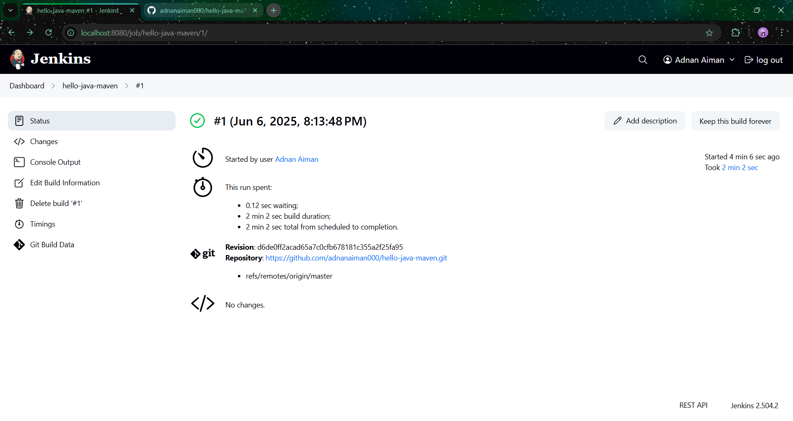
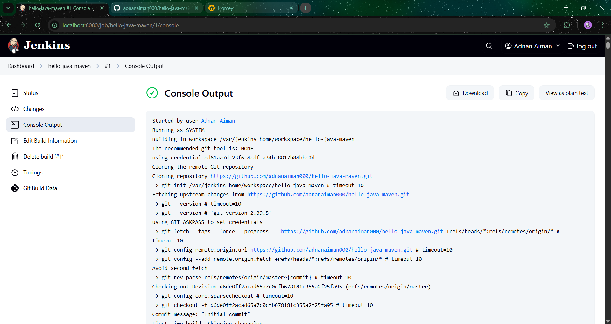

# Jenkins + Maven Java Build

## Task Overview  

- Created a simple Java `HelloWorld` app.
- Added a basic `pom.xml` to manage dependencies and build the project with Maven.
- Installed and ran **Jenkins** locally (via Docker).
- Configured **Maven** in Jenkins global tools.
- Created a **Freestyle Job** in Jenkins.
- Set the build goal to `clean package` using Maven.
- Ran the Jenkins job and verified the **"BUILD SUCCESS"** message in the console output.

## Screenshot

